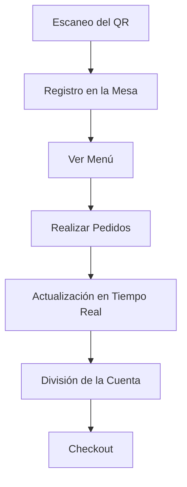

# EasyCheckOut ROADMAP

---

### 1. **Definición de Requisitos Funcionales**

- **Gestión de Mesas**: Cada mesa tendrá un QR único que los usuarios escanearán para unirse.
- **Perfiles de Usuario**: Cada usuario que escanee el QR se registrará en la mesa.
- **Menú y Pedidos**: Los usuarios podrán ver el menú y realizar pedidos desde sus dispositivos.
- **División de la Cuenta**: Al final, se mostrará un resumen de los pedidos de cada persona para facilitar la división de la cuenta.
- **Checkout**: El mesero podrá ver la "boleta electrónica" para procesar el pago con una máquina física (como GetNet o Mercado Pago).

---

### 2. **Arquitectura del Proyecto**

Estructura base con frontend en React y un backend en NestJS. Organización óptima (basado en archivos actuales, se estima escalado en archivos):

#### **Frontend (React)**

- **Vistas Principales**:
  - `MesaView.tsx`: Unirse a mesa mediante escaneo de QR.
  - `MenuView.tsx`: Ver menú y realizar pedidos.
  - `CheckoutView.tsx`: Mostrar resumen de pedidos y división de cuenta.
  - `Dashboard.tsx`: Panel de administración con métricas y overview.
  - `MesasPanel.tsx`: Gestión de mesas.
  - `MenuPanel.tsx`: CRUD para menú.
  - `ReportesView.tsx`: Reportes y analytics.
  - `ConfigView.tsx`: Configuración del sistema.
  - `BoletaView.tsx`: Boleta electrónica para meseros.
  - `MesasStatus.tsx`: Estado de mesas.
  - `KitchenDisplay.tsx`: Display de órdenes para cocina.
- **Componentes Reutilizables**:
  - `UserList.tsx`: Lista de usuarios en la mesa.
  - `PedidoItem.tsx`: Item de pedido.
  - `MenuCard.tsx`: Tarjeta de item del menú.
  - `MesaCard.tsx`: Tarjeta de mesa.
  - `MenuItemForm.tsx`: Formulario para crear/editar items del menú.
  - `Chart.tsx`: Gráficos para reportes.
- **Servicios**:
  - `api.ts`: Configuración base de Axios para llamadas al backend.
  - `authService.ts`: Manejo de login/logout.
  - `mesaService.ts`: API para mesas.
  - `pedidoService.ts`: API para pedidos.
  - `adminService.ts`: API para administración.
- **Hooks**:
  - `useWebSocket.ts`: Cliente WebSocket para comunicación en tiempo real.
  - `useAuth.ts`: Autenticación.
  - `useRealtime.ts`: Actualizaciones en tiempo real.
- **Contextos**:
  - `AuthContext.tsx`: Contexto de autenticación.
  - `MesaContext.tsx`: Contexto de mesa activa.
- **Utilidades**:
  - `formatters.ts`: Formateo de precios y fechas.
  - `validators.ts`: Validaciones.
- **Tipos**:
  - `Mesa.ts`: Definición de tipos para mesas.
  - `Pedido.ts`: Definición de tipos para pedidos.
  - `Usuario.ts`: Definición de tipos para usuarios.

#### **Backend (NestJS)**

- **Módulos**:
  - `auth`: Autenticación y autorización.
  - `usuarios`: Gestión de usuarios.
  - `mesa`: Gestión de mesas y usuarios conectados.
  - `pedido`: Gestión de pedidos realizados por los usuarios.
  - `menu`: Gestión del menú.
  - `admin`: Panel de administración.
  - `reportes`: Generación de reportes y analytics.
  - `common`: Utilidades comunes como filtros, interceptores y pipes.
- **Controladores y Servicios**:
  - `auth.controller.ts` y `auth.service.ts`: Manejo de autenticación.
  - `usuarios.controller.ts` y `usuarios.service.ts`: Manejo de usuarios.
  - `mesa.controller.ts` y `mesa.service.ts`: Manejo de la lógica de las mesas.
  - `pedido.controller.ts` y `pedido.service.ts`: Manejo de la lógica de los pedidos.
  - `menu.controller.ts` y `menu.service.ts`: Manejo del menú.
  - `dashboard.controller.ts` y `dashboard.service.ts`: Métricas y reportes.
  - `config.controller.ts`: Configuración del sistema.
- **WebSocket**:
  - `mesa.gateway.ts`: Comunicación en tiempo real para mesas.
  - `cocina.gateway.ts`: Comunicación en tiempo real para cocina.
- **DTOs**:
  - `create-mesa.dto.ts` y `update-mesa.dto.ts`: DTOs para mesas.
  - `create-pedido.dto.ts`: DTO para pedidos.
  - `create-menu-item.dto.ts`: DTO para items del menú.
- **Utilidades Comunes**:
  - `http-exception.filter.ts`: Filtro para excepciones HTTP.
  - `logging.interceptor.ts`: Interceptor para logging.
  - `validation.pipe.ts`: Pipe para validaciones.
- **Base de Datos**:
  - `schema.prisma`: Esquema de la base de datos.
  - `seed.ts`: Datos iniciales para la base de datos.

---

### 3. **Flujo de Trabajo/Usuario**

1. **Escaneo del QR**:
   - El usuario escanea el QR de la mesa y es redirigido a la vista de la mesa (`MesaView.tsx`).
   - El backend registra al usuario en la mesa correspondiente.

2. **Realización de Pedidos**:
   - Los usuarios ven el menú en `MenuView.tsx` y realizan pedidos.
   - Los pedidos se envían al backend y se actualizan en tiempo real para todos los usuarios de la mesa.

3. **División de la Cuenta**:
   - Al final, los usuarios ven el resumen de pedidos en `CheckoutView.tsx`.
   - El mesero accede a la "boleta electrónica" para procesar el pago.

---

### 4. **Tecnologías Clave**

- **Frontend**: React con TypeScript, Vite para el bundling.
- **Backend**: NestJS con TypeScript, Prisma para la base de datos.
- **Comunicación en Tiempo Real**: WebSocket para actualizaciones en vivo.
- **Base de Datos**: PostrgeSQL en Docker.

---

### 5. **Prioridad en realización**

1. **Desarrollar el Frontend**:
   - Implementar vistas principales (`MesaView.tsx`, `MenuView.tsx`, `CheckoutView.tsx`).
   - Implementar vistas de administración (`Dashboard.tsx`, `MesasPanel.tsx`, `MenuPanel.tsx`, `ReportesView.tsx`, `ConfigView.tsx`).
   - Implementar vistas para meseros (`BoletaView.tsx`, `MesasStatus.tsx`).
   - Implementar vistas para cocina (`KitchenDisplay.tsx`).
   - Conectar el frontend con el backend usando `api.ts` y `useWebSocket.ts`.
   - Implementar hooks (`useAuth.ts`, `useRealtime.ts`) y contextos (`AuthContext.tsx`, `MesaContext.tsx`).

2. **Configurar el Backend**:
   - Configurar módulos principales (`auth`, `usuarios`, `mesa`, `pedido`, `menu`, `admin`, `reportes`).
   - Implementar controladores y servicios para cada módulo (`auth.controller.ts`, `mesa.controller.ts`, `pedido.controller.ts`, etc.).
   - Configurar WebSocket para comunicación en tiempo real (`mesa.gateway.ts`, `cocina.gateway.ts`).
   - Implementar DTOs para validación de datos (`create-mesa.dto.ts`, `create-pedido.dto.ts`, etc.).
   - Configurar utilidades comunes (`http-exception.filter.ts`, `logging.interceptor.ts`, `validation.pipe.ts`).

3. **Probar la Aplicación**:
   - Testing del flujo completo: desde el escaneo del QR hasta la división de la cuenta.
   - Asegurar comunicación en tiempo real funcione correctamente.
   - Probar vistas de administración, meseros y cocina.
   - Validar integración con la base de datos (`schema.prisma`, `seed.ts`).

---

### 6. **Diagrama de Flujo**

Representación gráfica del flujo (punto 3):

---
