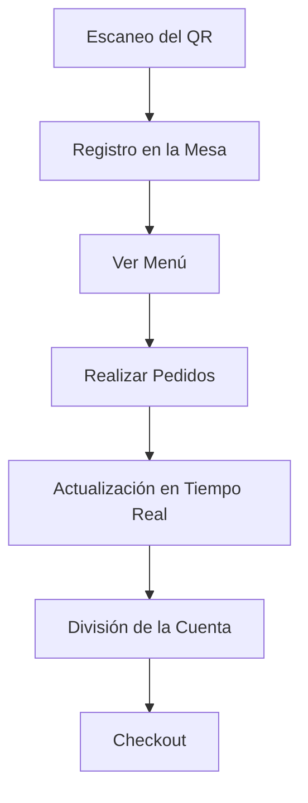

# EasyCheckOut ROADMAP

---

### 1. **Definición de Requisitos Funcionales**

- **Gestión de Mesas**: Cada mesa tendrá un QR único que los usuarios escanearán para unirse.
- **Perfiles de Usuario**: Cada usuario que escanee el QR se registrará en la mesa.
- **Menú y Pedidos**: Los usuarios podrán ver el menú y realizar pedidos desde sus dispositivos.
- **División de la Cuenta**: Al final, se mostrará un resumen de los pedidos de cada persona para facilitar la división de la cuenta.
- **Checkout**: El mesero podrá ver la "boleta electrónica" para procesar el pago con una máquina física (como GetNet o Mercado Pago).

---

### 2. **Arquitectura del Proyecto**

Estructura base con frontend en React y un backend en NestJS. Organización óptima (basado en archivos actuales, se estima escalado en archivos):

#### **Frontend (React)**

- **Vistas Principales**:
  - `MesaView.tsx`: Para mostrar la mesa y los usuarios conectados.
  - `MenuView.tsx`: Para mostrar el menú y permitir realizar pedidos.
  - `CheckoutView.tsx`: Para mostrar el resumen de pedidos y la división de la cuenta.
- **Componentes Reutilizables**:
  - `UserList.tsx`: Para mostrar la lista de usuarios en la mesa.
  - `PedidoItem.tsx`: Para mostrar los items del pedido.
- **Servicios**:
  - `api.ts`: Para manejar las llamadas al backend.
  - `useWebSocket.ts`: Para manejar la comunicación en tiempo real (WebSocket).

#### **Backend (NestJS)**

- **Módulos**:
  - `mesa`: Para gestionar las mesas y los usuarios conectados.
  - `pedido`: Para gestionar los pedidos realizados por los usuarios.
- **Controladores y Servicios**:
  - `mesa.controller.ts` y `mesa.service.ts`: Para manejar la lógica de las mesas.
  - `pedido.controller.ts` y `pedido.service.ts`: Para manejar la lógica de los pedidos.
- **WebSocket**:
  - `mesa.gateway.ts`: Para manejar la comunicación en tiempo real entre el frontend y el backend.

---

### 3. **Flujo de Trabajo/Usuario**

1. **Escaneo del QR**:
   - El usuario escanea el QR de la mesa y es redirigido a la vista de la mesa (`MesaView.tsx`).
   - El backend registra al usuario en la mesa correspondiente.

2. **Realización de Pedidos**:
   - Los usuarios ven el menú en `MenuView.tsx` y realizan pedidos.
   - Los pedidos se envían al backend y se actualizan en tiempo real para todos los usuarios de la mesa.

3. **División de la Cuenta**:
   - Al final, los usuarios ven el resumen de pedidos en `CheckoutView.tsx`.
   - El mesero accede a la "boleta electrónica" para procesar el pago.

---

### 4. **Tecnologías Clave**

- **Frontend**: React con TypeScript, Vite para el bundling.
- **Backend**: NestJS con TypeScript, Prisma para la base de datos.
- **Comunicación en Tiempo Real**: WebSocket para actualizaciones en vivo.
- **Base de Datos**: PostrgeSQL en Docker.

---

### 5. **Prioridad en realización**

1. **Desarrollar el Frontend**:
   - Implementra vistas principales (`MesaView`, `MenuView`, `CheckoutView`).
   - Conectar el frontend con el backend usando `api.ts` y `useWebSocket.ts`.

2. **Configurar el Backend**:
   - Configurar backend correctamente para manejar las mesas y pedidos.
   - Implementar los endpoints necesarios para registrar usuarios en una mesa y manejar pedidos.

3. **Probar la Aplicación**:
   - Testing del flujo completo: desde el escaneo del QR hasta la división de la cuenta.
   - Asegurar comunicación en tiempo real funcione correctamente.

---

### 6. **Diagrama de Flujo**

Representación gráfica del flujo (punto 3):

---
